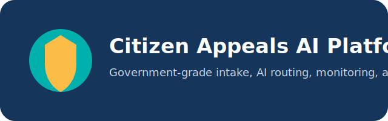

# Citizen Appeals AI Platform

<p align="center">
	
</p>

AI-powered government platform for centralized intake, processing, routing, monitoring, and analysis of citizen appeals. The current product focus is healthcare, while the core architecture is designed to expand to other public-sector agencies without rewriting the platform foundation.

## Project Overview

Citizen Appeals AI Platform solves the operational problem of fragmented citizen appeals across multiple systems such as iKomek, CRM, E-Otinish, Damumed, and future government channels. The platform brings these appeals into a single operational workflow with:

- centralized intake
- channel-aware routing
- duplicate and campaign detection
- AI-assisted response drafting
- SLA and escalation monitoring
- geographic and organizational analytics
- local-only LLM inference for protected government data

## Features

- Unified intake model with source-channel tracking and intake idempotency
- Mandatory geolocation for portal-originated incidents
- Eight AI agents for escalation, campaigns, duplicates, drafting, requester history, and healthcare routing
- Background AI execution through Redis + arq workers
- RAG-backed drafting flow using pgvector and local embeddings
- RBAC, audit logging, and requester privacy safeguards
- Multi-tenant healthcare organization model with regions, organizations, hospitals, and departments
- Social monitoring foundation and executive analytics

## Architecture

The platform is organized into six operational layers:

1. Frontend portals for citizens, operators, analysts, and administrators
2. Backend API for intake, workflow, analytics, admin, and monitoring
3. Background workers for AI orchestration, RAG indexing, and polling tasks
4. PostgreSQL + pgvector for transactional and semantic data
5. Redis for queues and streaming progress events
6. Local LLM runtime through Ollama or vLLM

Architecture documentation and diagrams:

- [docs/Architecture.md](docs/Architecture.md)
- [architecture/system-context.md](architecture/system-context.md)
- [architecture/runtime-containers.md](architecture/runtime-containers.md)
- [architecture/data-flow.md](architecture/data-flow.md)

## Technology Stack

### Backend

- FastAPI
- SQLAlchemy async ORM
- Alembic
- PostgreSQL 16 + pgvector
- Redis + arq
- sentence-transformers (`BAAI/bge-m3`)

### Frontend

- React 18
- TypeScript
- Vite
- TanStack Query
- React Router
- Tailwind CSS
- Recharts
- Framer Motion

### AI / RAG

- Ollama or vLLM
- Local embeddings and reranking
- pgvector semantic retrieval
- asynchronous draft generation and appeal analysis

### DevOps

- Docker Compose
- Nginx
- health checks and restart policies
- Husky, lint-staged, pre-commit
- GitHub Actions and Dependabot

## AI Agents

| Agent   | Responsibility                                      |
| ------- | --------------------------------------------------- |
| Agent 1 | Detect critical appeals and escalate urgent threats |
| Agent 2 | Detect coordinated campaigns and mass complaints    |
| Agent 3 | Detect semantic duplicates and repeat submissions   |
| Agent 4 | Prepare official response drafts with RAG           |
| Agent 5 | Analyze requester history and repeat patterns       |
| Agent 6 | Detect medicine supply issues and pharmacy routing  |
| Agent 7 | Detect care quality issues and quality routing      |
| Agent 8 | Detect sanitary and epidemiological risks           |

See [docs/AI.md](docs/AI.md) and [agents/README.md](agents/README.md).

## Screenshots

Repository screenshot assets are not committed yet. When product-safe screenshots are prepared, they should be stored under `docs/assets/` and referenced here.

Suggested future shots:

- citizen appeal submission flow
- operator intake dashboard
- AI admin panel
- geographic appeal map
- analytics and monitoring views

## Installation

### Prerequisites

- Docker and Docker Compose
- Node.js 20+
- Python 3.11+ for local tooling

### Quick Start

```bash
cp .env.example .env
docker compose up -d --build
docker compose exec backend python -m app.data.seed
docker compose exec backend python -m app.data.enterprise_seed
```

Platform URL: `http://localhost`

## Docker

The repository ships with:

- `docker-compose.yml` for the base stack
- `docker-compose.dev.yml` for development overlays
- `docker-compose.prod.yml` for production overlays
- `ollama` and `ollama-init` services for local model runtime bootstrap

See [docs/Docker.md](docs/Docker.md) and [docs/Deployment.md](docs/Deployment.md).

## Development

### Frontend

```bash
cd frontend
npm install
npm run dev
```

### Repository Tooling

```bash
npm install
python -m pip install pre-commit black isort ruff
pre-commit install
```

### Quality Checks

```bash
npm --prefix frontend run lint
npm --prefix frontend run build
black --check backend
isort --check-only backend
ruff check backend
```

## Repository Structure

```text
/
├── .github/          # issue templates, workflows, CODEOWNERS, dependabot
├── agents/           # repository-level AI agent documentation
├── architecture/     # Mermaid diagrams and system views
├── backend/          # FastAPI application, workers, agents, migrations
├── database/         # database overview and schema notes
├── docker/           # container architecture notes
├── docs/             # product, API, deployment, security, and dev documentation
├── frontend/         # React + TypeScript application
├── monitoring/       # monitoring and observability notes
├── nginx/            # reverse proxy configuration
├── playwright/       # future browser automation workspace
├── rag/              # repository-level RAG documentation
├── scripts/          # repository automation workspace
├── ssl/              # TLS certificate mount directory (contents not committed)
└── tests/            # automated and scenario tests
```

## Roadmap

High-level roadmap:

- repository foundation and governance
- unified intake core
- real integration layer
- AI admin platform
- geographic operations and facility registry
- focused social monitoring for Telegram and Instagram
- dashboard simplification and workflow hardening

See [ROADMAP.md](ROADMAP.md).

## License

This project is released under the [MIT License](LICENSE).

## Contributors

Initial repository ownership and maintenance: KazUTB Digital Development Center.

See [CONTRIBUTING.md](CONTRIBUTING.md) for contribution expectations and workflow.
