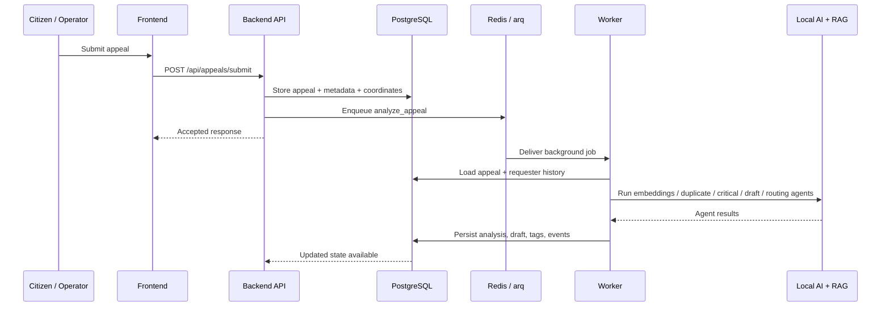

# Appeal Processing Flow

```mermaid
sequenceDiagram
    participant User as Citizen / Operator
    participant FE as Frontend
    participant API as Backend API
    participant DB as PostgreSQL
    participant Q as Redis / arq
    participant W as Worker
    participant AI as Local AI + RAG

    User->>FE: Submit appeal
    FE->>API: POST /api/appeals/submit
    API->>DB: Store appeal + metadata + coordinates
    API->>Q: Enqueue analyze_appeal
    API-->>FE: Accepted response
    Q->>W: Deliver background job
    W->>DB: Load appeal + requester history
    W->>AI: Run embeddings / duplicate / critical / draft / routing agents
    AI-->>W: Agent results
    W->>DB: Persist analysis, draft, tags, events
    DB-->>API: Updated state available
```
