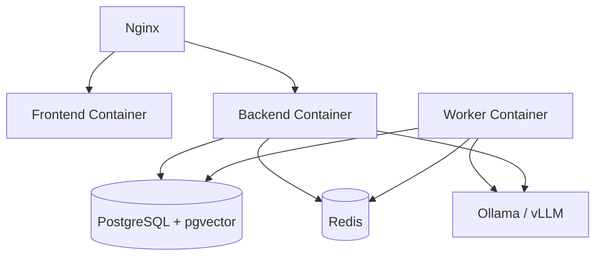

# Runtime Containers

```mermaid
flowchart TB
    Nginx[Nginx]
    Frontend[Frontend Container]
    Backend[Backend Container]
    Worker[Worker Container]
    Redis[(Redis)]
    Postgres[(PostgreSQL + pgvector)]
    Ollama[Ollama / vLLM]

    Nginx --> Frontend
    Nginx --> Backend
    Backend --> Postgres
    Backend --> Redis
    Worker --> Redis
    Worker --> Postgres
    Worker --> Ollama
    Backend --> Ollama
```
