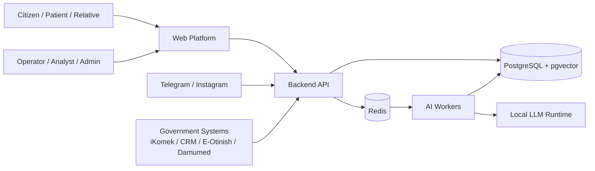

# System Context

```mermaid
flowchart LR
    Citizen[Citizen / Patient / Relative]
    Staff[Operator / Analyst / Admin]
    Portal[Web Platform]
    API[Backend API]
    Worker[AI Workers]
    DB[(PostgreSQL + pgvector)]
    Redis[(Redis)]
    LLM[Local LLM Runtime]
    Social[Telegram / Instagram]
    Ext[Government Systems\niKomek / CRM / E-Otinish / Damumed]

    Citizen --> Portal
    Staff --> Portal
    Portal --> API
    API --> DB
    API --> Redis
    Redis --> Worker
    Worker --> DB
    Worker --> LLM
    Social --> API
    Ext --> API
```
